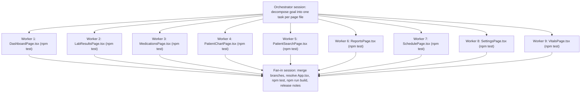

# Playbook: Massively Parallel Devin Sessions for CogHealth EHR Modernization

This playbook shows how to modernize the CogHealth EHR monorepo with many Devin
sessions running at once, and — critically for a demo — how every one of those
sessions proves its work with passing tests.

## 1. Overview & goal

### The fan-out / fan-in model

1. **Orchestrator session** — takes one large goal ("modernize the frontend"),
   inspects the repo, and decomposes it into *independent* per-unit tasks. It
   produces one prompt per unit (see the template in section 5) and assigns any
   shared resources up front (branch names, migration numbers, etc.).
2. **N worker sessions** — run in parallel. Each owns exactly one unit, works on
   its own branch, verifies with the test suite, and opens a PR. Workers never
   touch another worker's unit or the shared "serialization point" files listed
   in section 4.
3. **Fan-in session** — merges the worker branches, resolves the small number of
   shared-file edits in one place, runs the full test suite and builds, and
   produces release notes.



### Why this repo decomposes well

- **Frontend: one file per page.** `demos-coghealth-ehr-web/src/pages/` holds
  nine self-contained page components, each mounted by a single `<Route>` in
  `src/App.tsx`. A worker can improve one page without touching any other.
- **Backend: per-class services.** `demos-coghealth-ehr-api/src/main/java/com/medchart/ehr/service/`
  (plus `service/chronic/`) is a flat set of `*Service` classes, each a natural
  unit of work.
- **Isolated `legacy` package.** `com/medchart/ehr/legacy/` is walled off by
  `.devin/rules/backend.md` ("never copy its patterns into new code"), so each
  class there can be migrated independently.

### Recommended demo scenario

**Use the frontend modernization fan-out (section 2).** It is the only area of
the repo with a working, runnable test suite out of the box
(`demos-coghealth-ehr-web/tests/e2e.test.ts`, Jest + Puppeteer). Every worker
session can end its run with green tests, which is exactly what you want an
audience to see. The backend scenarios in section 3 are real modernization work
but have weaker out-of-the-box verification.

## 2. Primary scenario — frontend modernization fan-out with test verification

### Decomposition: one session per page file

| Worker | Unit (`demos-coghealth-ehr-web/src/pages/`) | Route in `src/App.tsx` |
|--------|---------------------------------------------|------------------------|
| 1 | `DashboardPage.tsx` | `/` |
| 2 | `LabResultsPage.tsx` | `/labs` |
| 3 | `MedicationsPage.tsx` | `/medications` |
| 4 | `PatientChartPage.tsx` | `/patients/:id` |
| 5 | `PatientSearchPage.tsx` | `/patients` |
| 6 | `ReportsPage.tsx` | `/reports` |
| 7 | `SchedulePage.tsx` | `/schedule` |
| 8 | `SettingsPage.tsx` | `/settings` |
| 9 | `VitalsPage.tsx` | `/vitals` |

### What each worker changes

Each session makes a **focused, style-preserving** improvement to its single
page, following `.devin/rules/frontend.md`:

- **Loading and error states** — reuse `LoadingOverlay`, `Modal`, `Badge` from
  `src/components/ui/` rather than inventing new patterns.
- **Form validation** — use the already-installed `react-hook-form` + `zod`
  (with `@hookform/resolvers`) for any form on the page. No new packages.
- **Accessibility** — labels for inputs, `aria-*` attributes on dialogs and
  status indicators, keyboard focus handling, semantic headings.
- Reuse `Button`, `Card`, `Input` from `src/components/ui/` and `PatientBanner`
  / `PatientSearch` from `src/components/patient/`; use `lucide-react` icons.
- Preserve the dense EHR desktop style (small fonts, compact layouts, CSS
  variables in `src/index.css`).
- All HTTP stays behind the `api` wrapper in `src/services/api.ts`.
- **Do not add dependencies unless clearly necessary.**
- **Do not edit `src/App.tsx`** (routes / nav) — see section 4.

### Verification — the key selling point

The repo already ships a runnable Jest + Puppeteer e2e suite:

- Tests: `demos-coghealth-ehr-web/tests/e2e.test.ts`
- Config: `demos-coghealth-ehr-web/jest.config.cjs`
  (`preset: 'ts-jest'`, `testMatch: ['**/tests/**/*.test.ts']`, 30 s timeout)
- Coverage: navigation across every page, global patient search, dashboard
  widgets, per-page dialogs (orders, prescriptions, print), and HIPAA
  indicators.

Each worker runs this exact flow from `demos-coghealth-ehr-web/`:

```bash
cd demos-coghealth-ehr-web
npm install

# Terminal 1 — the suite targets http://localhost:5173
npm run dev

# Terminal 2 — run the full suite (or scope it)
npm test
# or: npm run test:e2e        # jest --testPathPattern=tests/e2e

# Production build must also pass (AGENTS.md / .devin/rules/frontend.md)
npm run build                 # tsc -b && vite build
```

A green `npm test` after the change demonstrates **no regression across the
whole app**, not just the page the worker touched — every worker's PR can show
this.

**Backend-dependent assertions self-skip.** A handful of tests need real data
from the API on `:8080`. When it is absent they log
`Skipping: ... requires backend API` and pass, so a green run without the
backend still exercises all the UI paths. If you want fuller coverage during the
demo, start the backend first:

```bash
cd demos-coghealth-ehr-api
mvn spring-boot:run -Dspring-boot.run.profiles=dev
```

(See `.devin/skills/start-dev-environment/SKILL.md` and `.devin/skills/run-verify/SKILL.md`.)

### Each worker adds its own test file

Ask every worker to add a focused test for its new behavior as a **separate
file** under `demos-coghealth-ehr-web/tests/`, e.g.
`tests/dashboard-page.test.ts`, `tests/vitals-page.test.ts`. The
`**/tests/**/*.test.ts` glob picks it up automatically. Mirror the conventions
in the existing `tests/e2e.test.ts` (Puppeteer `launch({ headless: true })`,
`1280x800` viewport, `BASE_URL = 'http://localhost:5173'`, `waitForSelector` /
`waitForFunction` on `.ehr-header` / `.ehr-status-bar`) and follow
`.devin/skills/build-tests/SKILL.md`.

> **Why separate files:** if nine sessions each append to the single shared
> `tests/e2e.test.ts`, that file becomes a merge/serialization point and the
> fan-in session has to hand-resolve nine conflicting diffs. One test file per
> page keeps the workers completely conflict-free.

## 3. Secondary scenarios (weaker out-of-box verification)

These are legitimate modernization fan-outs, but be upfront that verification is
not as crisp as the frontend scenario.

### Backend upgrade: Java 11 → 17, Spring Boot 2.7.18 → 3.x

Work in `demos-coghealth-ehr-api/pom.xml` and the source tree: `javax.*` →
`jakarta.*` imports, Spring Security config rewrite (component-based
`SecurityFilterChain`), springdoc / JJWT / Hibernate dependency bumps.

**Caveat:** `demos-coghealth-ehr-api/src/test/` does not exist — there are no
backend tests, so `mvn test` has nothing to run. Verification falls back to
`mvn spring-boot:run -Dspring-boot.run.profiles=dev` against the **shared** Neon
PostgreSQL and manual/Swagger checks (`http://localhost:8080/api/swagger-ui/index.html`).
That is a weaker path and effectively serialized (one shared DB, one `pom.xml`).

### Backend test-coverage fan-out

One session per service/controller class:
`service/AppointmentService.java`, `EncounterService.java`,
`InsuranceGateway.java`, `PatientService.java`,
`ProviderNotificationService.java`, `ProviderService.java`,
`CustomUserDetailsService.java`, and `service/chronic/ChronicMedicationService.java`,
`MedicationAdherenceTracker.java`, `MedicationNotificationService.java`,
`PharmacyIntegrationService.java` (controllers under `controller/` likewise).
Each worker creates the missing JUnit/Mockito tests under `src/test/java/com/medchart/ehr/...`
following `.devin/skills/build-tests/SKILL.md`, and verifies with
`mvn test -Dtest=<TestClass>`.

This is the **prerequisite** that would make the backend upgrade scenario as
verifiable as the frontend one — run it first if you want a two-act backend
demo.

### Legacy package migration

One session per class in `demos-coghealth-ehr-api/src/main/java/com/medchart/ehr/legacy/`:
`EncounterExportService.java`, `InsuranceCache.java`,
`LegacyPatientLookup.java`, `ReportGenerator.java`. Each worker re-implements
the class in the proper `controller → service → repository → domain` layering.
Per `.devin/rules/backend.md`, legacy patterns must **not** be copied into new
code. Same verification caveat as above until backend tests exist.

## 4. Serialization points / conflict rules

Files that multiple parallel sessions **must not** edit without coordination:

| Shared file | Rule for workers |
|-------------|------------------|
| `demos-coghealth-ehr-web/src/App.tsx` | Routes and nav items live here. Workers do not add or rename routes; if a page needs a route change, note it in the PR description for the fan-in session. |
| `demos-coghealth-ehr-web/tests/e2e.test.ts` | Do not append. Put new tests in a new per-page `tests/<page>.test.ts`. |
| `demos-coghealth-ehr-api/src/main/resources/db/migration/` | Never edit an existing `V{n}__*.sql`. New schema changes need a **newly-numbered** file; the orchestrator assigns migration numbers up front (per `.devin/rules/backend.md`). |
| `demos-coghealth-ehr-api/pom.xml` | Dependency/version changes are owned by one session only (the upgrade session or fan-in). |
| `demos-coghealth-ehr-web/package.json` | No new dependencies from workers; anything truly needed is batched into fan-in. |

**Recommendation:** batch all shared-file edits into the single fan-in session
rather than letting any worker touch them.

## 5. Reusable per-session prompt template

Copy one of these per worker, filling in the blanks.

```text
You are one of several parallel Devin sessions modernizing the CogHealth EHR
frontend in COG-GTM/demos-coghealth-ehr-combined.

SCOPE
- Your unit: demos-coghealth-ehr-web/src/pages/<PAGE_FILE>.tsx  (route: <ROUTE>)
- Improvement: <one of: loading/error states | form validation with
  react-hook-form + zod | accessibility> — keep it focused and style-preserving.
- Do NOT edit src/App.tsx, tests/e2e.test.ts, package.json, or any other page.

BRANCH
- git checkout -b devin/$(date +%s)-<page-slug>-modernize
  (e.g. devin/1712345678-vitals-page-modernize)

RULES
- Follow .devin/rules/frontend.md: reuse src/components/ui/ and
  src/components/patient/, lucide-react icons, dense EHR desktop style,
  all HTTP through src/services/api.ts.
- Do not add dependencies unless clearly necessary (react-hook-form, zod,
  @hookform/resolvers are already installed).

TESTS
- Add demos-coghealth-ehr-web/tests/<page-slug>.test.ts covering your new
  behavior, mirroring tests/e2e.test.ts conventions
  (see .devin/skills/build-tests/SKILL.md).

VERIFY (all from demos-coghealth-ehr-web/)
  npm install
  npm run dev          # leave running; serves http://localhost:5173
  npm test             # full Jest + Puppeteer suite must be green
  npm run build        # tsc -b && vite build must succeed

DELIVER
- Open a PR against main titled "<PAGE_FILE>: <improvement>". In the
  description include the npm test summary (passed / skipped counts) and note
  any route/nav change you need the fan-in session to make in src/App.tsx.
```

## 6. Fan-in / integration checklist

1. **Collect** all worker PRs; confirm each has a green `npm test` and
   `npm run build` in its description.
2. **Create an integration branch** from `main`
   (`devin/$(date +%s)-frontend-modernization-fan-in`) and merge the worker
   branches one at a time. Conflicts should be rare because each worker owned
   one page file and one test file.
3. **Resolve serialization-point files** in this session only:
   - `demos-coghealth-ehr-web/src/App.tsx` — apply any route/nav changes the
     workers requested in their PR descriptions.
   - Any shared test file (`tests/e2e.test.ts`) if a worker touched it anyway.
   - `demos-coghealth-ehr-web/package.json` if a dependency was genuinely
     required.
   - If backend work was included: `demos-coghealth-ehr-api/pom.xml` and
     renumber Flyway migrations so `V{n}` is strictly increasing with no gaps
     or duplicates.
4. **Run the full frontend suite** from `demos-coghealth-ehr-web/`:
   `npm install`, `npm run dev` (background), `npm test`, `npm run lint`,
   `npm run build`. Every per-page test file plus `e2e.test.ts` must pass.
5. **If the backend changed**, from `demos-coghealth-ehr-api/`:
   `mvn spring-boot:run -Dspring-boot.run.profiles=dev`, confirm startup and
   Swagger UI, then re-run `npm test` with the backend up so the
   previously-skipped assertions execute.
6. **Produce release notes** with `.devin/skills/release-notes/SKILL.md`
   (clinician-friendly summary from the merged git history).
7. **Open the integration PR** to `main` with the release notes and the
   aggregate test/build results.
